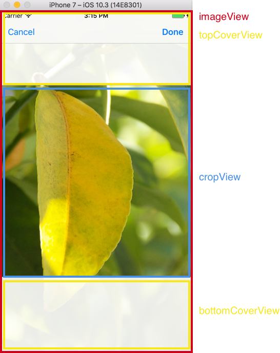
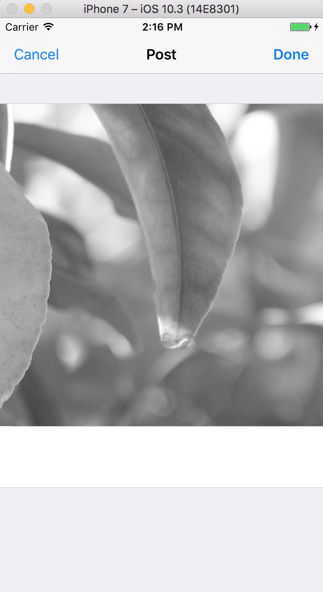

# Graygram
----

Q. ManualLayout, Kingfisher는 앱 모듈전체에서 한번만 임포트하면 사용가능한데 왜 AlamoFire는 안되지?


A. ManualLayout, Kingfisher는 기존의 데이터타입을 익스텐션하였기 때문에 전역에서 사용가능하고, Alamofire는 새로운 클래스를 open으로 제공하기 때문에 필요한 파일마다 직접 import를 해주어야 한다!!

> 라이브러리 중 익스텐션을 이용한 라이브러리를 import할 땐, AppDelegate에서 한번만 import해주는게 깔끔하다. 그 외의 경우는 각 파일에서 import를 해주어야 할 것이다...

> SnapKit으로 오토레이아웃을 구현할 때는 항상 뷰가 __addSubView()__ 메소드로 뷰 계층에 추가 된 후에 오토레이아웃을 적용해야 런타임 에러가 나질 않는다. 주의하자!!

----
### UIImageView Extension

UIImageView를 익스텐션하여 setImage(photoID:size:)를 구현. 

```swift
enum PhotoSize {
  case tiny
  case small
  case medium
  case large
  
  var pointSize: Int {
    switch self {
    case .tiny: return 20
    case .small: return 40
    case .medium: return 320
    case .large: return 640
    }
  }
  
  /// 실제 렌더링할 때 쓰이는 물리픽셀
  var pixelSize: Int {
    return self.pointSize * Int(UIScreen.main.scale)
  }
}
```
----

### 화면 하단(collectionView의 footer)에 Indicator 표시 


----

### paging구현

나와는 다르게(?) scrollView delegate 메소드를 활용하여 현재의 컨텐츠 오프셋 + height값이 컨텐츠 사이즈 보다 커질 때 페이징을 요청하도록 함. 불필요한 복수의 페이징요청을 피하기 위해 _isLoading_ 불리언 값을 활용하여 요청 중일 땐 곧바로 return 되도록 함.

```swift
// MARK: Fetch
  fileprivate func fetchPosts(isMore: Bool = false) {
    // isLoading이 참일 시 (즉 로딩중이면) 곧바로 종료 return
    guard !isLoading else { return }
    
    let urlString: String
    
    // 페이징 요청이 아닐 경우
    if !isMore {
      urlString = feedURL
    } else if let nextURLString = self.nextURLString {
    	// 페이징 요청일 경우 +  다음 페이지가 존재하는 경우
      urlString = nextURLString
    } else {
    	// 페이징 요청이지만 다음 페이지가 없을 경우
      return
    }
    
    // isLoading 을 true로 해주어 불필요한 fetchPost호출을 막는다.
    self.isLoading = true
    UIApplication.shared.isNetworkActivityIndicatorVisible = true
    
    Alamofire.request(urlString)
      .responseJSON { response in
      	 // 응답이 왔으니 더 이상 로딩 중이 아님
        self.isLoading = false
        self.refreshControl.endRefreshing()
        UIApplication.shared.isNetworkActivityIndicatorVisible = false
        
        switch response.result {
        case .success(let value):
          guard let json = value as? [String : Any] else { return }
          guard let jsonArray = json["data"] as? [[String : Any]] else { return }
          
          let newPosts = [Post](JSONArray: jsonArray)
          // Array<Post>.init(JSONArray: jsonArray) 와 동일
          
          // 더 보기 요청이 아닌경우 -> 데이터 모델을 newPost로 초기화
          if !isMore {
            self.posts = newPosts
          } else {
          // 더 보기 요청일 경우 -> 원래의 데이터 모델에 추가
            self.posts += newPosts
          }

          let paging = json["paging"] as? [String: Any]
          // 다음 페이징 요청을 위한 urlString 저장
          self.nextURLString = paging?["next"] as? String
          
          // 새로운 데이터가 왔으니 콜렉션뷰 리로드
          self.collectionView.reloadData()
          
        case .failure(let error):
          print(error)
        }
    }
  }
  
  // MARK: - UIScrollView Delegate
extension FeedViewController {
  func scrollViewDidScroll(_ scrollView: UIScrollView) {
  	//  컨텐츠 사이즈가 0인 경우. 즉, 초기에 컬렉션 뷰에 컨텐츠가 없어 사이즈가 0인 경우는 종료
    guard scrollView.contentSize.height > 0  else { return }
   
   // 페이징 요청을 위해 현재의 오프셋이 마지막셀(=스크롤뷰의 제일 하단)에 도달했는지 비교를 위한 상수 
    let contentOffsetBottom = scrollView.contentOffset.y + scrollView.height
    // 현재 오프셋이 컨텐츠 사이즈보다 클 경우 페이징 요청
    if contentOffsetBottom >= scrollView.contentSize.height - 300 {
      fetchPosts(isMore: true)
    }
  }
  
}

```

----

### 로그인 VC 구현

- self.topLayoutGuide 에도 Snapkit이 익스텐션을 구현해 놓았다.
```
make.top.equalTo(self.topLayoutGuide.snp.bottom).offset(30)
```
- Snapkit은 체이닝이 가능하다!!! 
```
make.left.right.height.equalTo(usernameTextField)
```

```
if let  data = response.data,
let json = (try? JSONSerialization.jsonObject(with: data)) as? [String: Any],
let errorInfo = json["error"] as? [String: Any],
let field = errorInfo["field"] as? String {
switch field {
    case "username":
      self.usernameTextField.becomeFirstResponder()
    case "password":
      self.passwordTextField.becomeFirstResponder()
    default:
      break
        }
  }
```
위의 코드에서 너무 많은 옵셔널을 한 번에 바인딩하여 코드의 가독성이 떨어진다. DataResponse를 익스텐션하여 error, filed를 튜플로 반환하는 메소드를 추가하여 아래와 같이 코드의 가독성을 높이고 깔끔하게 만든다.

```
extension DataResponse {
  func errorInfo() -> (field: String, message: String)? {
    guard let data = self.data,
      let json = (try? JSONSerialization.jsonObject(with: data)) as? [String: Any],
      let errorInfo = json["error"] as? [String: Any],
      let field = errorInfo["field"] as? String,
      let message = errorInfo["message"] as? String
    else { return nil }
    return (field, message)
  } 
}
```
아래와 같이 코드가 깔끔해졌다.!!
   
```         
if let errorInfo = response.errorInfo() {
    switch errorInfo.field {
    case "username":
      self.usernameTextField.becomeFirstResponder()
    case "password":
      self.passwordTextField.becomeFirstResponder()
    default:
      break
    }
  }
```

> UIResponder를 상속받은 컨트롤에 타겟과 액션메소드를 연결할 때, 해당 메소드를 fileprivate로 접근제한을 걸고 싶다면 _dynamic_ 키워드를 앞에 붙여 사용해야 한다. *fileprivat* 만 사용했을 경우 컴파일 에러가 난다.

```
dynamic fileprivate func method() {
	// do something...
}
```


- like버튼 눌럿을 시 액션 완성
- 탭바컨트롤러 추가
- 이미지피커 추가 
- Notification.Name 에 익스텐션으로 name을 추가
- 


----

# 6/21 

## CropViewController 구현

<p align="center">

</p>

### 1. 이미지 크롭영역 

기본 이미지 피커로는 가로 또는 세로로 긴 이미지를 정사각형으로 수정하지 못하므로 따로 이미지를 크롭할 수 있게 구현한다. 이미지가 크롭되는 영역을 사용자가 보면서 스크롤 할 수 있게 top, bottomView를 corpView 상, 하에 배치한다. (SnapKit을 사용하여..)

```swift
override func viewDidLoad() {
    super.viewDidLoad()
    self.view.backgroundColor = .white
    
    self.automaticallyAdjustsScrollViewInsets = false
    
    self.scrollView.showsVerticalScrollIndicator = false
    self.scrollView.showsHorizontalScrollIndicator = false
    self.scrollView.alwaysBounceVertical = true
    self.scrollView.alwaysBounceHorizontal = true
    self.scrollView.maximumZoomScale = 3
    self.scrollView.delegate = self
    
    self.topCoverView.isUserInteractionEnabled = false
    self.bottomCoverView.isUserInteractionEnabled = false
    self.cropAreaView.isUserInteractionEnabled = false
    
    self.scrollView.addSubview(self.imageView)
    self.view.addSubview(self.scrollView)
    self.view.addSubview(self.topCoverView)
    self.view.addSubview(self.bottomCoverView)
    self.view.addSubview(self.cropAreaView)
    
    self.scrollView.snp.makeConstraints { make in
      make.edges.equalToSuperview()
    }
    self.cropAreaView.snp.makeConstraints { make in
      make.width.equalToSuperview()
      make.height.equalTo(self.cropAreaView.snp.width)
      make.centerY.equalToSuperview()
    }
    self.topCoverView.snp.makeConstraints { make in
      make.top.left.right.equalToSuperview()
      make.bottom.equalTo(self.cropAreaView.snp.top)
    }
    self.bottomCoverView.snp.makeConstraints { make in
      make.bottom.left.right.equalToSuperview()
      make.top.equalTo(self.cropAreaView.snp.bottom)
    }
}
```

### 2. 이미지 크기에 따라 스크롤 뷰 Inset조정

```swift
override func viewDidLayoutSubviews() {
    super.viewDidLayoutSubviews()
    if self.imageView.size == .zero {
      self.initializeContentSize()
    }
  }
  
  // MARK : Configure Content
  
  private func initializeContentSize() {
    guard let image = self.imageView.image else { return }
    let imageWidth = image.size.width
    let imageHeight = image.size.height
    
    if imageWidth > imageHeight {                       // 가로로 긴 이미지 (landscape)
      self.imageView.height = self.cropAreaView.height
      self.imageView.width = self.cropAreaView.height * imageWidth / imageHeight
    } else if imageWidth < imageHeight {                // 세로로 긴 이미지 (portrait)
      self.imageView.width = self.cropAreaView.width
      self.imageView.height = self.cropAreaView.width * imageHeight / imageWidth
    } else {                                            // 정사각형
      self.imageView.size = self.cropAreaView.size
    }
    
    self.scrollView.contentInset.top = (self.scrollView.height - self.cropAreaView.height) / 2
    self.scrollView.contentInset.bottom = self.scrollView.contentInset.top
    self.scrollView.contentSize = self.imageView.size
    self.centerContent()
  }
  
  fileprivate func centerContent() {
    self.scrollView.contentOffset.x = (self.scrollView.contentSize.width - self.scrollView.width) / 2
    self.scrollView.contentOffset.y = (self.scrollView.contentSize.height - self.scrollView.height) / 2
  }
```
이미지를 가로가 긴 이미지 또는 세로가 긴 이미지, 정사각형 이미지가 있을 것이다. 이에 맞추어 imageView의 width,height를 설정하고 scrollView의 contentInset을 조정한다. 마지막으로 이미지가 가운데에 오게끔 하기 위해 scrollView의 contentOffset을 조정한다.

### 3. 이미지 크롭하기

```swift
	// dontButton이 탭되었을 시 (= 이미지 크롭) 호출되는 메소드
	
  fileprivate dynamic func doneButtonItemDidTap(_ sender: UIBarButtonItem) {
    guard let image = self.imageView.image else { return }
    
    // cropAreaView.frame을 imageVIew.frame과 같은 좌표계로 변경
    var rect = self.scrollView.convert(self.cropAreaView.frame, from: self.cropAreaView.superview)
    let widthRatio = image.size.width / self.imageView.width
    let heightRatio = image.size.height / self.imageView.height
    
    rect.origin.x *= widthRatio
    rect.origin.y *= heightRatio
    rect.size.width *= widthRatio
    rect.size.height *= heightRatio
    
    if let croppedCGImage = image.cgImage?.cropping(to: rect) {
      let croppedImage = UIImage(cgImage: croppedCGImage)
      self.didFinishCropping?(croppedImage)
    }
  }
```
이미지를 크롭하기 위해선 현재 rootView로부터의 cropAreaView와 상대적인 좌표를 가져와야 한다. 이를 위해 **convert(to:from:)**메소드를 사용해 rect좌표를 가져온다. 이 좌표를 이용해 현재 image와 imageView의 비율을 계산하고 rect좌표에 적용하여 실제 이미지를 크롭하는 메소드인 **cgImage?.cropping(to:)**를 사용하여 이미지를 크롭한다. 

```swift
fileprivate func presentCropViewController(image: UIImage) {
    let cropViewController = CropViewController(image: image)
    cropViewController.didFinishCropping = { image in
      guard let grayscaledImage = image.grayscaled() else { return }
      self.dismiss(animated: true, completion: nil)
      self.presentPostEditViewController(image: grayscaledImage)
    }
    
    let navigationController = UINavigationController(rootViewController: cropViewController)
    self.present(navigationController, animated: true, completion: nil)
}
```
App이름인 graygram처럼 클로저로 받아온 이미지의 색깔을 gray로 바꾸고 PostEditViewController의 프로퍼티로 넘겨준다. 

이미지를 gray로 바꾸는 작업은 UIImage를 익스텐션하여 아래와 같이 구현한다.

```swift

// UIImage+Grayscale.swift

import UIKit

extension UIImage {
  func grayscaled() -> UIImage? {
    
    guard let context = CGContext(
      data: nil,
      width: Int(self.size.width),
      height: Int(self.size.height),
      bitsPerComponent: 8,
      bytesPerRow: 0,
      space: CGColorSpaceCreateDeviceGray(),
      bitmapInfo: .allZeros
    )
    else { return nil }
    
    guard let inputCGImage = self.cgImage else { return nil }
    let imageRect = CGRect(origin: .zero, size: self.size)
    context.draw(inputCGImage, in: imageRect)
    guard let outputCGImage = context.makeImage() else { return nil }
    
    return UIImage(cgImage: outputCGImage)
  }
}
```


> 스크롤뷰는 컨텐츠사이즈가 있어야만 스크롤이 가능하다.
> navigationController는 navigationController에 루트뷰 컨트롤러로 할당되었을 때 사용가능하므로 이니셜라이져에서는 사용불가능하다. 네비게이션컨트롤러를 사용하려면 viewDidLoad 이후에 사용하자.


----


# 6/25

## PostEditViewController 구현

이미지 피커로 가져온 이미지에 사용자에게서 텍스트를 입력받기 위해 두 개의 셀을 가진 테이블뷰로 구성했음.

<p align="center">

</p>


### 1. Keyboard에 TextView가 가려지지 않도록 해보자

``` swift
let keyboardVisibleHeight = UIScreen.main.bounds.height - keyboardFrame.y
    UIView.animate(withDuration: duration) {
      self.tableView.contentInset.bottom = keyboardVisibleHeight
      self.tableView.scrollToRow(
        at: IndexPath(row: 1, section: 0),
        at: .none,
        animated: false
      ) // 이미 UIView의 애니메이션 메소드 안이므로 animated를 false를 준다.
    }
```

키보드 노티를 받아 인풋뷰에 가려지는 셀을 보여지게 하기 위해 프레임을 조정하는 것은 하수의 방법. 좋은 방법이 아니다!! 좋은 방법은 contentInset을 이용하는것!!


> transaction과 UI작업은 모두 메인스레드에서 작동(?)되기 때문에 키보드관련 노티를 받아 실행하는 애니메이션은 같은 __duration__ 을 할당 안 해주어도 키보드 애니메이션과 맞추어 애니메이션이 실행된다. 이 부분은 좀 더 알아봐야 할 것이다.


### 2. scrollView에 keyboardDismissMode 프로퍼티를 알아보자

```swift
@available(iOS 7.0, *)
public enum UIScrollViewKeyboardDismissMode : Int {

    case none
    case onDrag // dismisses the keyboard when a drag begins
    case interactive // the keyboard follows the dragging touch off screen, and may be pulled upward again to cancel the dismiss
}
```

ScrollView에는 키보드와 관련된 Enum이 있다. **onDrag**케이스는 키보드가 show인 상태에서 스크롤뷰를 드래그하게 되면 자동으로 키보드가 내려간다. **interactive**케이스는 사용자가 스크롤을하여 아래로 스크롤할때 interactive하게 스크롤 움직임에 맞추어 키보드가 내려가게 된다.

## PostEditViewTextCell 구현

PostEditViewTextCell은 텍스트 뷰로 텍스트를 입력받을 수 있게 만든 셀이다. 

```swift
final class PostEditViewTextCell: UITableViewCell {
  // 1.
  fileprivate enum Font {
    static let textView = UIFont.systemFont(ofSize: 14)
  }
  
  // MARK: Properties
  
  fileprivate let textView = UITextView()
  
  // 2.
  var textDidChange: ((String?) -> Void)?
  
  // 1. 생성자 -> 2. 설정 -> 3. 레이아웃 -> 4. 크기 순으로 구현 ~~~
  
  // MARK: Initailizers
  
  override init(style: UITableViewCellStyle, reuseIdentifier: String?) {
    super.init(style: style, reuseIdentifier: reuseIdentifier)
    
    self.textView.font = Font.textView
    self.textView.delegate = self
    self.textView.isScrollEnabled = false
    self.contentView.addSubview(self.textView)
  }
  
  required init?(coder aDecoder: NSCoder) {
    fatalError("init(coder:) has not been implemented")
  }
  
  // MARK: Configure
  
  func configure(text: String?) {
    self.textView.text = text
    setNeedsLayout()
  }
  
  // MARK: Layout
  
  override func layoutSubviews() {
    super.layoutSubviews()
    self.textView.size = self.contentView.size
  }
  
  // MARK: Size
  // 3.
  class func height(width: CGFloat, text: String?) -> CGFloat {
    let margin = CGFloat(10)
    let minimumHeight = ceil(Font.textView.lineHeight) * 3
    guard let text = text else { return minimumHeight + margin * 2 }
    return max(text.size(width: width, font: Font.textView).height,
               minimumHeight) + margin * 2
  }
}

// MARK: - TextView Delegate

extension PostEditViewTextCell: UITextViewDelegate {
  
  // 2.
  func textViewDidChange(_ textView: UITextView) {
    self.textDidChange?(textView.text)
  }
}
```

### 1. TextView의 Font를 위한 Enum

```swift
fileprivate enum Font {
	static let textView = UIFont.systemFont(ofSize: 14)
}

```

Font를 알게 되면 해당텍스트에 양에 따른 그 높이를 알 수 있다. 셀의 사이즈(높이)를 가져오기 위해 클래스 메소드를 활용하는데 클래스 메소드 안에선 인스턴스 프로퍼티나 메소드를 사용하지 못하므로 클래스 전역에 만든 Font Enum안에 static 프로퍼티를 만들어 사용가능하게 하였다. 

### 2. 텍스트가 입력될 때마다 실행될 콜백 클로저

```swift
var textDidChange: ((String?) -> Void)?
  
	...

extension PostEditViewTextCell: UITextViewDelegate {
  
  func textViewDidChange(_ textView: UITextView) {
    self.textDidChange?(textView.text)
  }
}
```

셀에 텍스트를 입력하다가 한 줄 이상넘어가게되면 셀의 높이를 변경하는 것이 좋은 UI일 것이다. 이를 위해 텍스트가 입력될 때마다 ViewController에서 제어하기 위한 클로저를 프로퍼티로 선언하였다. TextView의 텍스트가 바뀔때마다(change) 호출 될 델리게이트 메소드 안에서 이 클로저를 실행시킨다.

```swift
// PostEditViewController.swift

func tableView(_ tableView: UITableView, cellForRowAt indexPath: IndexPath) -> UITableViewCell {
    
    switch indexPath.row {
    case 0:
		...
    case 1:
		....
      textCell.textDidChange = { text in
        self.text = text
        self.tableView.beginUpdates()
        self.tableView.endUpdates()
        self.tableView.scrollToRow(
          at: IndexPath(row: 1, section: 0),
          at: .none,
          animated: true)
      }
      return textCell
    default:
		....
    }
  }
```

PostEditViewController에서는 self.text를 파라메터로 받아 셀의 높이를 계산한다. 이를 위해 클로저에서 self.text에 클로저로 넘어온 텍스트를 할당하고 이 것으로 테이블 뷰를 다시 그리게하여 높이를 조정한다.

>셀 안의 텍스트가 변경될 때마다 리로드하게 되면 포커스를 잃으므로 사용자가 계속 텍스트뷰를 탭해야 하는 엄청난 불편함이 있다. 이를 위해 __tableView.beginUpdates()__, __tableView.endUpdates()__ 메소드를 활용하면 포커스를 잃지 않고 테이블뷰를 리로드하여 UI를 업데이트하는 효과를 얻을 수 있다.

----

# 6/26 

## PostEditViewController의 BarButtonItem구현 

```swift
final class PostEditViewController: UIViewController {
  
  // MARK: Properties
  
  fileprivate let cancelButtonItem = UIBarButtonItem(
    barButtonSystemItem: .cancel,
    target: nil,
    action: nil
  )
  fileprivate let doneButtonItem = UIBarButtonItem(
    barButtonSystemItem: .done,
    target: nil,
    action: nil
  )
}
```
두 가지의 **BarButtonItem** 은 참조를 계속 가질 필요가 있으므로 인스턴스 프로퍼티로 할당해준다. 프로퍼티의 초기값을 설정할 땐 아직 이니셜라이징이 되지 않은 후라 self와 인스턴스 메소드 & 프로퍼티를 사용할 수 없어 **BarButtonItem**의 타겟과 액션을 설정하지 않은채로 남겨 두지만 아래와 같이 **lazy**로 지연시켜준다면 사용가능하다. 하지만 lazy는 상수가 아닌 변수로 사용해야하므로 **BarButtonItem**이 **mutable**해져 변경 될 수 있는 문제를 가지고 있으므로 수열님은 이니셜라이져에서 따로 액션과 타겟을 설정한다고 한다.

```swift
fileprivate lazy var doneButtonItem = UIBarButtonItem(
    barButtonSystemItem: .done,
    target: self,
    action: #selector(doneButtonItemDidTap(_:))
  )
```

## - doneButton을 탭했을 시 동작할 post메소드 구현

사진과 post해야하므로 기존의 텍스트만 서버에 보낼 때와는 달리 data를 서버가 받을 수 있도록 가공해주는 작업이 필요하다. 

1. 파라메터에 데이터를 담아 보내거나
2. 멀티파트폼을 이용해 보내거나
3. JSON으로 보낼 수 있다 

여기서는 2번의 멀티파트 폼을 이용해 post하였다.

```swift
fileprivate dynamic func doneButtonItemDidTap(_ sender: UIBarButtonItem) {
    
    let urlString = "https://api.graygram.com/posts"
    Alamofire.upload(
      multipartFormData: { formData in   // 1.
        if let imageData = UIImageJPEGRepresentation(self.image, 1) {  // JPEG인코딩, 손실압축
          //        UIImagePNGRepresentation(<#T##image: UIImage##UIImage#>) // PNG 인코딩, 무손실압축
          formData.append(
            imageData,
            withName: "photo",
            fileName: "photo",
            mimeType: "image/jpeg"     // imageData가 어떤형식으로 된 이미지인지 나타내주는 타입
          )
        }
        if let textData = self.text?.data(using: .utf8) {
          formData.append(
            textData,
            withName: "message"
          )
        }
      },
      to: urlString,		
      method: .post,		
      encodingCompletion: { encodingResult in  // 2.
        switch encodingResult {
        case .success(let request, _, _):
          print("인코딩 성공 \(request)")
          request
            .uploadProgress { progress in
              // Progress의 totalUnitCount와 copletedUnitCount 프로퍼티를 조사해보자
              self.progressView.progress = Float(progress.completedUnitCount) / Float(progress.totalUnitCount)
            }
            .validate(statusCode: 200..<400)
            .responseJSON { response in
              switch response.result {
              case .success(let value):
                print("업로드 성공: \(value)")
                if let json = value as? [String: Any],
                  let post = Post(JSON: json) {
                  NotificationCenter
                    .default
                    .post(
                      name: .postDidCreate,
                      object: self,
                      userInfo: ["post": post]
                    )
                }
                self.dismiss(animated: true, completion: nil)
              case .failure(let error):
                print("업로드 실패: \(error)")
                self.setContorlsEnabled(true)
                self.progressView.isHidden = false
              }
            }
        case .failure(let error):
          print("인코딩 실패 \(error)")
          self.setContorlsEnabled(true)
          self.progressView.isHidden = false
        }
      }
    )
  }
```

### 1. multipartFormData
첫 번째 파라메터의 **multipartFormData**를 받는 클로저를 통해 멀티파트폼데이터에 데이터를 append하여 보내면 된다. 

```swift
multipartFormData: { formData in   
        if let imageData = UIImageJPEGRepresentation(self.image, 1) { 
          formData.append(
            imageData,
            withName: "photo",
            fileName: "photo",
            mimeType: "image/jpeg"     // imageData가 어떤형식으로 된 이미지인지 나타내주는 타입
          )
        }
        if let textData = self.text?.data(using: .utf8) {
          formData.append(
            textData,
            withName: "message"
          )
        }
      },
```
이미지와 텍스트를 **UIImageJPEGRepresentation**를 통해 data로 바꾸어 준 뒤 **formData**에 추가한다.

>UIImageJPEGRepresentation는 Image를 JPEG포맷으로 만든다. 손실 압축가능
>
>UIImagePNGRepresentation는 PNG포맷으로 만든다. 무손실 압축

### 2. encodingCompletion 

```swift
encodingCompletion: { encodingResult in  // 2.
        switch encodingResult {
        case .success(let request, _, _):
          print("인코딩 성공 \(request)")
          request
            .validate(statusCode: 200..<400)
            .responseJSON { response in
              switch response.result {
              case .success(let value):
                print("업로드 성공: \(value)")
                if let json = value as? [String: Any],
                  let post = Post(JSON: json) {
                  NotificationCenter
                    .default
                    .post(
                      name: .postDidCreate,
                      object: self,
                      userInfo: ["post": post]
                    )
                }
                self.dismiss(animated: true, completion: nil)
              case .failure(let error):
                print("업로드 실패: \(error)")
                self.setContorlsEnabled(true)
                self.progressView.isHidden = false
              }
            }
        case .failure(let error):
          print("인코딩 실패 \(error)")
        }
      }
```
encoding이 완료되면 위의 클로저가 실행된다. 클로저로 encodingResult가 담겨져 들어오는데 이 것을 통해 인코딩의 성공여부를 판단한다.
성공했을 경우 encodingResult에 연관값으로 들어온 **UploadRequest**을 이용해 리퀘스를 보낸다. 리퀘스트가 완료되었을 때 실행될 핸들러를 통해 post모델을 생성하고 노티를 보내준 뒤 컨트롤러를 dismiss한다.


## - post할 시 UI업데이트

**post**가 완료되면 UI를 업데이트하여 자기가 올린 post를 확인할 수 있어야 한다. 이를 위해 FeedViewController에서 feed를 다시 요청하여 업데이트 할 수 있지만, feed를 다시 요청하는 것은 시간이 들며 퍼포먼스면에서도 좋지 않을 것이다. 그리하여 포스트가 생성되었음을 알리는 노티를 받고 같이 담겨온 post 데이터를 통해 내부적으로 collectionView에 cell을 추가하는 방식을 사용하였다. 

```swift
// FeedViewController

NotificationCenter.default.addObserver(
      self,
      selector: #selector(postDidCreate),
      name: .postDidCreate,
      object: nil
    )

fileprivate dynamic func postDidCreate(notification: Notification) {
    guard let post = notification.userInfo?["post"] as? Post else { return }
    self.posts.insert(post, at: 0)
    self.collectionView.reloadData()
  }
```
FeedViewController에 **postDidCreate**라는 노티를 받을 수 있게 설정하고 노티에 담겨온 userInfo속 "post"키를 이용하여 post 데이터를 가져온 뒤 collectionView DataSource 첫번째에 추가하여 리로드 시킨다.

## - 업로드 중 Control들을 disabled한다.

```swift
fileprivate func setContorlsEnabled(_ isEnabled: Bool) {
    self.cancelButtonItem.isEnabled = isEnabled
    self.doneButtonItem.isEnabled = isEnabled
    self.view.isUserInteractionEnabled = isEnabled
  }
  
// 
 fileprivate dynamic func doneButtonItemDidTap(_ sender: UIBarButtonItem) {
    self.setContorlsEnabled(false)
    ....
}

case .failure(let error):
	print("업로드 실패: \(error)")
	self.setContorlsEnabled(true)
```
post요청을 하기 전에 컨트롤들을 사용할 수 없도록 하고, 업로드 또는 리퀘스트가 실패했을 경우 다시 컨트롤들을 사용할 수 있게한다. success케이스에선 어차피 컨트롤러가 dismiss되므로 사용할 필요가 없을 것이다.

## - progressView 구현

```swift
// PostEditViewController.swift

fileprivate let progressView = UIProgressView()

init(image: UIImage) {
    self.image = image
    super.init(nibName: nil, bundle: nil)
   	 ....
    
    self.progressView.isHidden = true
    
    ....
}
  
 override func viewDidLoad() {
    super.viewDidLoad()
    ...
    self.view.addSubview(self.progressView)
	 ...
    self.progressView.snp.makeConstraints { make in
      make.top.equalTo(self.topLayoutGuide.snp.bottom)
      make.left.right.equalToSuperview()    // == make.left.right.equalTo(0)과 같다.
    }
    ...
}  
```

UIProgressView를 인스턴스 프로퍼티로 할당한 후 이니셜라이져에서 히든을 해준다. viewDidLoad()에서 뷰계층에 추가한 뒤, SnapKit을 사용하여 오토레이아웃을 적용한다.

```swift
request
	.uploadProgress { progress in
	  self.progressView.progress = Float(progress.completedUnitCount) / Float(progress.totalUnitCount)
	}
	.validate(statusCode: 200..<400)
	....
```
upload의 encodingCompletion 핸들러에서 리퀘스트를 요청할 때 validate하기 전에 **uploadProgress**를 이용하여 전체 데이터(progress.totalUnitCount)에서 현재 보낸 데이터(progress.completedUnitCount)를 알 수 있다. 이 값을 이용하여 progressView의 progress 프로퍼티에 값을 할당해주면 된다.


## - PostCell을 두 가지 타입(card, tile)으로 구현

```swift
final class FeedViewController: UIViewController {

  enum ViewMode {
    case card
    case tile
  }
  
  ....
  
  fileprivate var viewMode: ViewMode = .card {
    didSet {
      switch self.viewMode {
      case .card:
        self.navigationItem.leftBarButtonItem = self.tileButtonItem
      case .tile:
        self.navigationItem.leftBarButtonItem = self.cardButtonItem
      }
      self.collectionView.reloadData()
    }
  }
  
  ....
}
```
현재 Feed가 카드, 타일 두 가지의 경우가 있으므로 이를 enum으로 정의해준 뒤 이 viewMode에 따라서 각각 다른 셀을 사용해준다. **self.viewMode**가 바뀌었다는 것은 BarButtonItem이 바뀌어야 하고 collectionView가 리로드해야하므로 이를 프로퍼티 감시자를 통해 구현해 주었다.

```swift
extension FeedViewController: UICollectionViewDataSource {
	
  ....

  func collectionView(
    _ collectionView: UICollectionView,
    cellForItemAt indexPath: IndexPath
    ) -> UICollectionViewCell {
    switch self.viewMode {
    case .card:
      let cell = collectionView.dequeueReusableCell(
        withReuseIdentifier: "cardCell",
        for: indexPath
        ) as! PostCardCell
      cell.configure(post: self.posts[indexPath.item])
      return cell
    case .tile:
      let cell = collectionView.dequeueReusableCell(
        withReuseIdentifier: "tileCell",
        for: indexPath
      ) as! PostTileCell
      let post = self.posts[indexPath.item]
      cell.configure(post: post)
      return cell
    }
  }
  
  ....
  
}
```
self.viewMode에 따라 각각 다른 셀을 리턴해 준다.

```swift
extension FeedViewController: UICollectionViewDelegateFlowLayout {
  
  func collectionView(
    _ collectionView: UICollectionView,
    layout collectionViewLayout: UICollectionViewLayout,
    sizeForItemAt indexPath: IndexPath
    ) -> CGSize {
    switch self.viewMode {
    case .card:
      let post = self.posts[indexPath.item]
      return PostCardCell.size(width: collectionView.frame.size.width, post: post)
    case .tile:
      return PostTileCell.size(width: collectionView.width / 3)
    }
    
  }
  
  func collectionView(
    _ collectionView: UICollectionView,
    layout collectionViewLayout: UICollectionViewLayout,
    referenceSizeForFooterInSection section: Int
    ) -> CGSize {
    
    // 더보기 요청이 불가능 한 경우 (마지막 페이지에 도달)
    if self.nextURLString == nil && !self.posts.isEmpty {
      return .zero
    } else {
      return CGSize(width: collectionView.width, height: 44.0)
    }
  }
  
  func collectionView(
    _ collectionView: UICollectionView,
    layout collectionViewLayout: UICollectionViewLayout,
    insetForSectionAt section: Int
    ) -> UIEdgeInsets {
    switch self.viewMode {
    case .card:
      return UIEdgeInsets(top: 10, left: 0, bottom: 10, right: 0)
    case .tile:
      return UIEdgeInsets.zero
    }
  }
  
  func collectionView(
    _ collectionView: UICollectionView,
    layout collectionViewLayout: UICollectionViewLayout,
    minimumLineSpacingForSectionAt section: Int
    ) -> CGFloat {
    switch self.viewMode {
    case .card:
      return 20
    case .tile:
      return 0
    }
  }
  
  func collectionView(
    _ collectionView: UICollectionView,
    layout collectionViewLayout: UICollectionViewLayout,
    minimumInteritemSpacingForSectionAt section: Int
    ) -> CGFloat {
    return 0
  }
  
}
```
각 셀의 크기는 다르므로 이 또한 viewMode의 케이스에 따라 달리 사이즈를 결정해 준다.


## - PostTileCell 구현

```swift
final class PostTileCell: UICollectionViewCell {
  
  fileprivate let tileImageView = UIImageView()
  
  var didTap: (() -> Void)?
  
  // MARK: Initializers
  
  override init(frame: CGRect) {
    super.init(frame: frame)
    
    self.contentView.addSubview(self.tileImageView)
    
    let tapGestureRecognizer = UITapGestureRecognizer(
      target: self,
      action: #selector(contentViewDidTap)
    )
    self.contentView.addGestureRecognizer(tapGestureRecognizer)
  }
  required init?(coder aDecoder: NSCoder) {
    fatalError("init(coder:) has not been implemented")
  }
  
  // MARK: Configure
  
  func configure(post: Post) {
    self.tileImageView.setImage(photoID: post.photoID, size: .medium)
  }
  
  // MARK: Layout
  
  override func layoutSubviews() {
    super.layoutSubviews()
    self.tileImageView.size = self.contentView.size
  }
  
  // MARK: Size
  
  class func size(width: CGFloat) -> CGSize {
    return CGSize(width: width, height: width)
  }
 
  // MARK: Selector
  // Gesture
  fileprivate dynamic func contentViewDidTap() {
    self.didTap?()
  }
}
```
### - PostTileCell 에 TapGestureRecognizer 넣어 구현.

```swift
  override init(frame: CGRect) {
    super.init(frame: frame)
    
    self.contentView.addSubview(self.tileImageView)
    
    let tapGestureRecognizer = UITapGestureRecognizer(
      target: self,
      action: #selector(contentViewDidTap)
    )
    self.contentView.addGestureRecognizer(tapGestureRecognizer)
  }
```
TileCell이 탭되었을 시 상세화면으로 푸쉬해야하므로 이를 위한 tapGestureRecognizer를 구현한다.

>Q. CollectionView의 Delegate를 이용하여 구현할 수 있지만 왜 TileCell에 제스쳐를 등록하여 구현하였나?
>
>A. Cell이 종류가 두 가지이므로 Delegate를 이용하면 Cell종류에 따라 분기처리를 해야할 것이다. 이것보단 셀이 직접 터치 이벤트를 받게하는 것이 좀 더 편하다고 한다.

### - ViewMode가 tile일 시 셀을 탭하면 상세화면으로 넘어가는 기능 구현(PostViewController 구현)

```swift
// PostTileCell
final class PostTileCell: UICollectionViewCell {
  
  ....
  
  var didTap: (() -> Void)?
}

// FeedViewController 

func collectionView(
    _ collectionView: UICollectionView,
    cellForItemAt indexPath: IndexPath
    ) -> UICollectionViewCell {
    switch self.viewMode {
    case .card:
		....
    case .tile:
      let cell = collectionView.dequeueReusableCell(
        withReuseIdentifier: "tileCell",
        for: indexPath
      ) as! PostTileCell
      let post = self.posts[indexPath.item]
      cell.configure(post: post)
      cell.didTap = {
        let postViewController = PostViewController(postID: post.id)
        self.navigationController?.pushViewController(postViewController, animated: true)
      }
      return cell
    }
  }
```
FeedViewController의 셀을 반환해주는 메소드안에서 셀을 생성한뒤 configure해주고 didTap클로저에 PostViewController를 네비게이션 컨트롤러로 푸쉬하는 코드를 구현한다.

----

# 6/28


