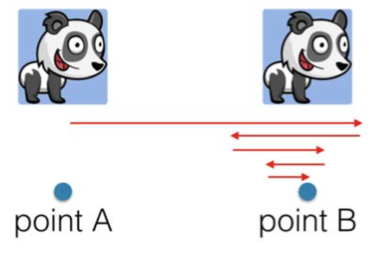

### UIView Animation
- Animatable properties (애니메이션이 가능한 속성 값)

종류 | 속성
--- | ---
Position And Size | bounds, frame, center
Appearance | backgroundColor, alpha
Transformation | trasnform

--

- Animation method of UIView

UIView의 애니메이션 메소드는 여러가지가 있지만 아래의 메소드가 거의 모든 경우를 포함하고 있어 한 가지만 조사해보았다.

``` swift
class func animate(withDuration duration: TimeInterval, delay: TimeInterval, usingSpringWithDamping dampingRatio: CGFloat, initialSpringVelocity velocity: CGFloat, options: UIViewAnimationOptions = [], animations: @escaping () -> Void, completion: ((Bool) -> Void)? = nil)
```

파라메터 | 설명
--- | ---
withDuration | 애니메이션의 지속시간
delay | 애니메이션이 시작되기 전 UIKit이 wait하는 시간
usingSpringWithDamping |  그림과 같이 스프링처럼 튕기는? 정도를 위한 값이다. 0.0에서 1.0의 값을 가지며 0으로 갈 수록 많이 튕기는 애니메이션이 된다.
initialSpringVelocity | ??
options | 커스터마이징 가능한 옵션 값
animations | 애니메이션이 정의되는 클로저(@escaping, 즉 탈출클로저) 
completion | 애니메이션이 끝난 후 실행되는 콜백메소드

--

- Animation Options

Option | 설명
--- | ---
repeat | 계속 반복
autoreverse | 애니메이션을 forward, backword하게 실행 (반드시 repeat 옵션과 같이 사용해야함)
curveEaseIn | 애니메이션이 시작될 때 점점 가속되게 함
curveEaseOut | 애니메이션이 끝날 때 점점 감속되게 함
curveEaseInOut | EaseIn과 EaseOut을 합친 옵션
... | 

--

- Transition

```swift
class func transition(with view: UIView, duration: TimeInterval, options: UIViewAnimationOptions = [], animations: (() -> Void)?, completion: ((Bool) -> Void)? = nil)
```


--


