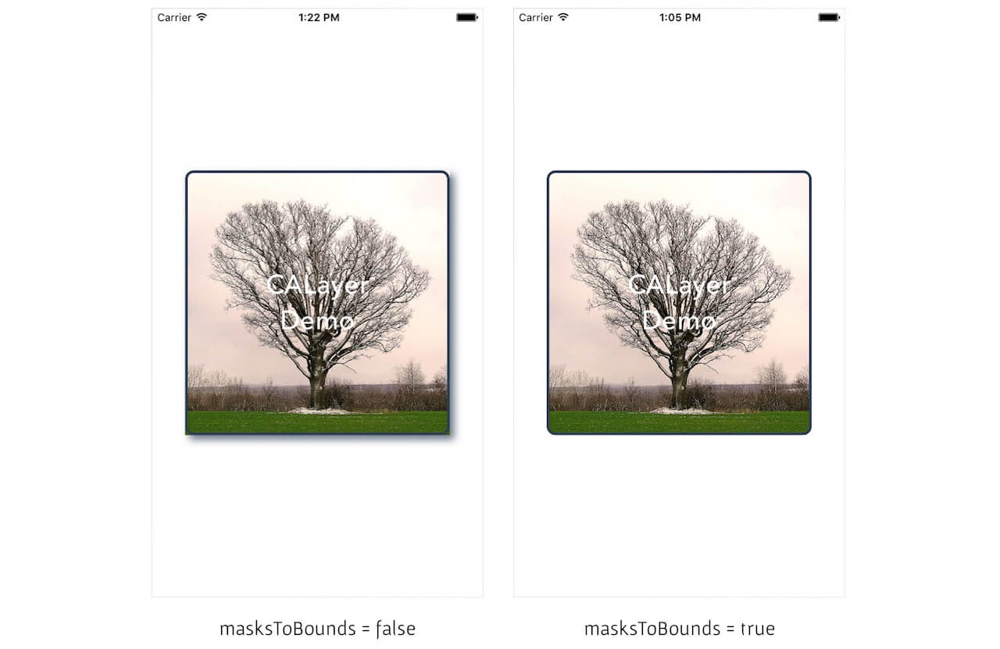

----
# _masksToBounds_ 와 _clipToBounds_ 의 차이?
- masksToBounds

이 값에 true을 할당하면 CoreAnimation이 layer의 bounds와 일치하고 conerRadius 이펙트를 포함한 implicit(암묵적) clipping mask을 생성하는 것 같다. 내가 이해하기론 view의 clipToBounds처럼 리시버의 경계를 벗어난 모든 서브레이어를 clip한다는 것 같다. 
>
아래의 코드처럼 어떠한 뷰의 레이어에 shadow를 주었을 때, masksToBounds가 false로 되어있다면 layer에 shadow가 보이지 않게된다.


``` swift
view.layer.shadowOffset = CGSizeMake(5, 5)
view.layer.shadowOpacity = 0.7
view.layer.shadowRadius = 5
view.layer.shadowColor = UIColor(red: 44.0/255.0, green: 62.0/255.0, blue: 80.0/255.0, alpha: 1.0).CGColor

```
>





- clipToBounds

receiver의 경계밖의 모든 서브뷰들을 clip할지 안할지 결정하는 Bool 타입의 프로퍼티

----


